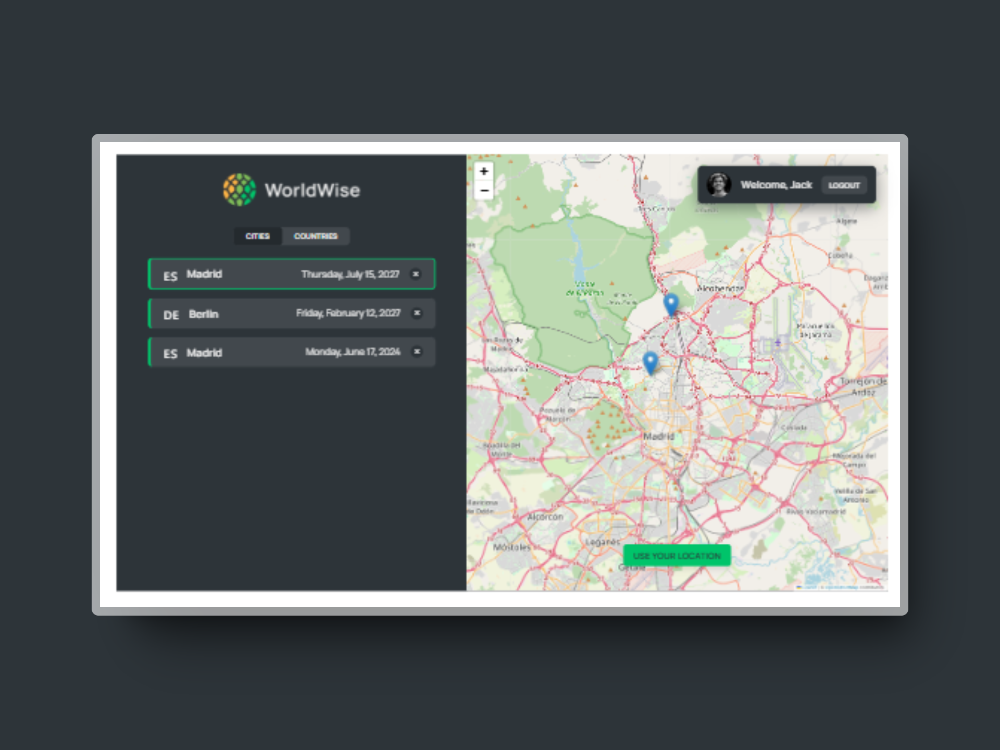

# 🌎 WorldWise

This is a React project developed using [Vite](https://vitejs.dev/) as part of '[The Ultimate React Course 2024](https://www.udemy.com/course/the-ultimate-react-course/)' by Jonas Schmedtmann.

## What I learned

In this project, I build a web app that keeps track of places visited on the world map and provides a visible list and side notes. With this project,I was able to grasp the fundamentals of React, covering topics such as:

Sure, here is the concise list:

- Managing state with `useReducer`.
- Using CSS Modules for styling.
- Creating single-page applications (SPA) with React Router.
- Linking between routes with `<Link />` and `<NavLink />`.
- Implementing nested routes and index routes.
- Dynamic routes with URL parameters.
- Programmatic navigation with `useNavigate` and `<Navigate />`.
- Creating and providing context with Context API.
- Consuming context with `useContext`.
- Combining Context API with `useReducer` for advanced state management.

### Screenshot

Here's a glimpse of the final project:



## Installation

To install the project, follow these steps:

1. Clone the repository:

```bash
git clone https://github.com/xyzeez/worldwise.git
```

2. Navigate to the project directory:

```bash
cd worldwise
```

3. Install dependencies:

```bash
npm install
```

4. Start the application:

```bash
npm run dev
```
